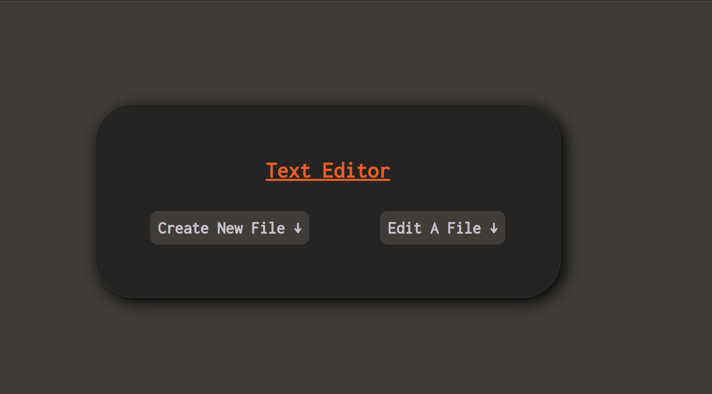
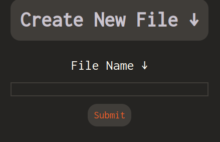
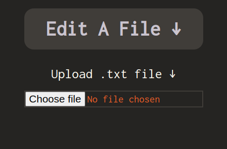
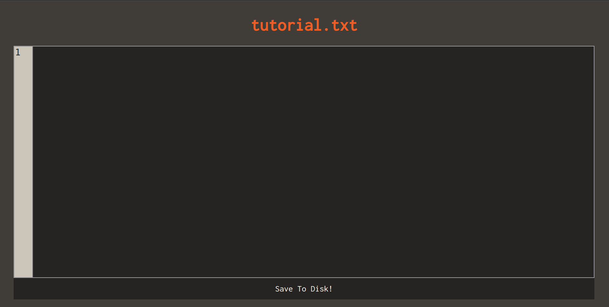
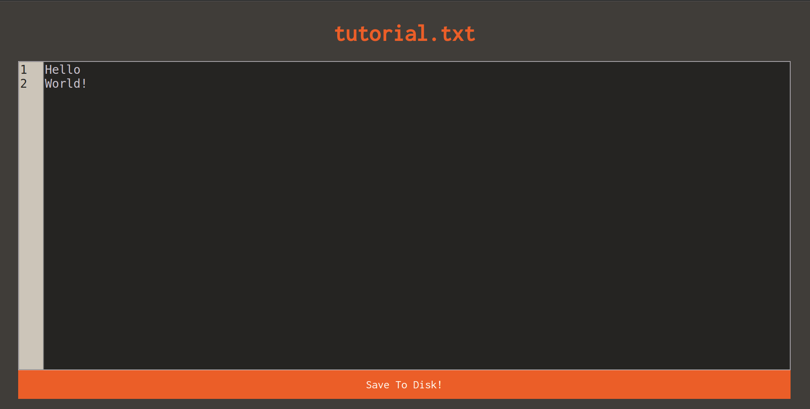
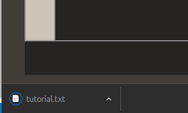
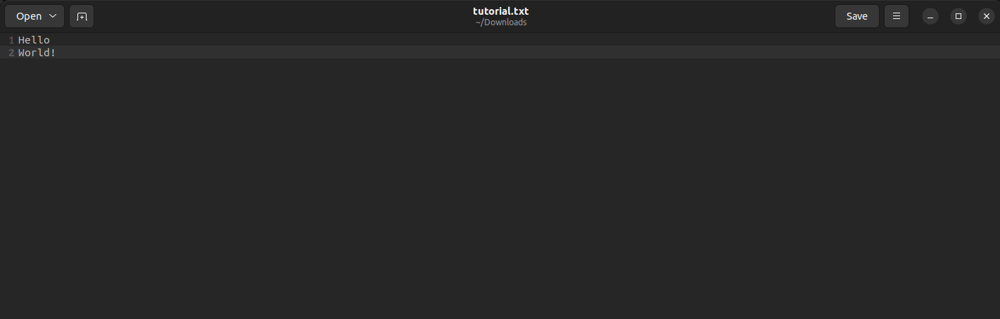

 

### Summary

A simple static website that allows you to create and edit text files from within the browser.

This project was created during my 6th week of the JustIT software development boot camp after covering two weeks of javascript, two weeks of CSS and an initial week of HTML.

##### Note if you clone this Repository and run it locally it might not allow you to download any files due to most browsers blocking HTTP downloads.

###### The work around would be to use a tool such as [OpenSSL](https://www.openssl.org/)

### How to use the Text Editor :

-   Go to [The Github Pages Site](https://s-riches.github.io/PW-TextEditor/)
-   You will presented with this screen 
-   From here you can either Create a new file or edit a existing file

#### Create a file :

-   To Create a new file click on the The gray button that says 'Create New File '
-   Simply Type in the name of the file you will be creating!
-   ##### Bonus : if you name your file and include '.md' at the end you can create a markdown file!

#### Edit a file :

-   To Edit a File click on the 'Edit A File' )
-   Then Simply click 'Choose file' which should open your file explorer! any .txt file or .md file is accepted!

#### In the text editor :

-   Once in the text editor after either creating a new file or editing a file you should see a screen similar to this 
-   To begin Typing simply click on the black box and begin typing whatever you want! 
-   Once you are finished with your work - press the save button down at the bottom of the page! 
-   As you can see you will get a .txt file (unless you specified your file as .md format)
-   And you can view your file from your downloads folder! 

#### How it works :

-   The way the files are created in the browser is through [javascript's Blob object](https://developer.mozilla.org/en-US/docs/Web/API/Blob) which represents a collection of data. .png>)
-   The user writes all of their data into HTML's text area tag, and when the user clicks the save button at the bottom - the script fires the download function.png>)
-   The line counter works by reading the value of the text area, then checking how many times the `\n` character appears - splitting it into lines - and then creating an array with the number of lines separated by new line characters. This updates on any user input .png>)
-   We read files with Javascript's built in [FileReader](https://developer.mozilla.org/en-US/docs/Web/API/FileReader) object .png>)
